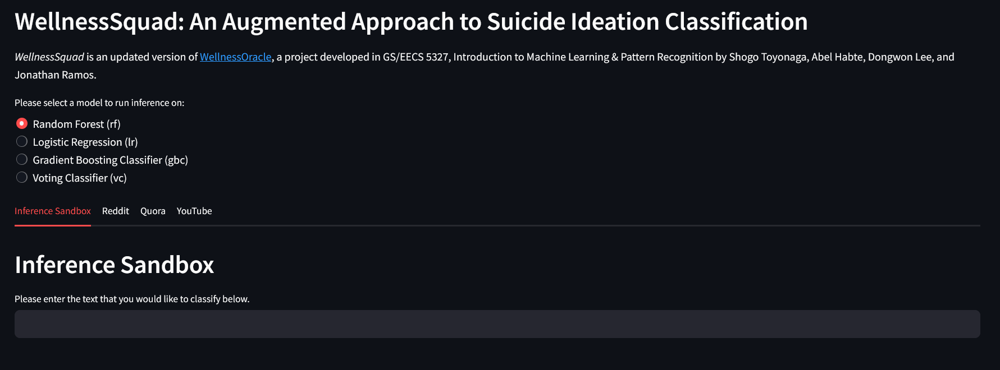
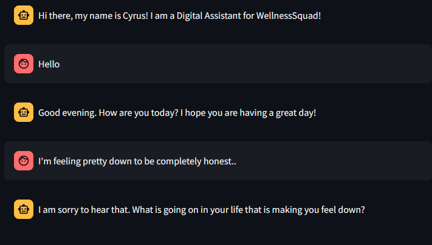
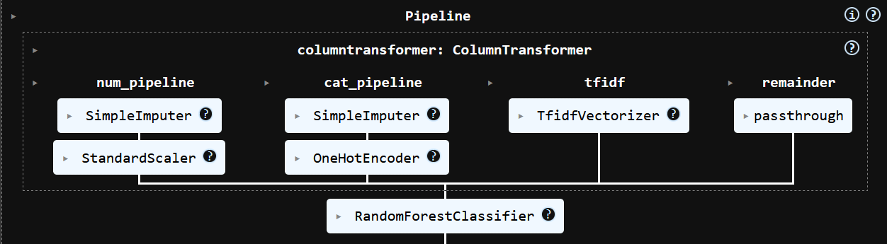
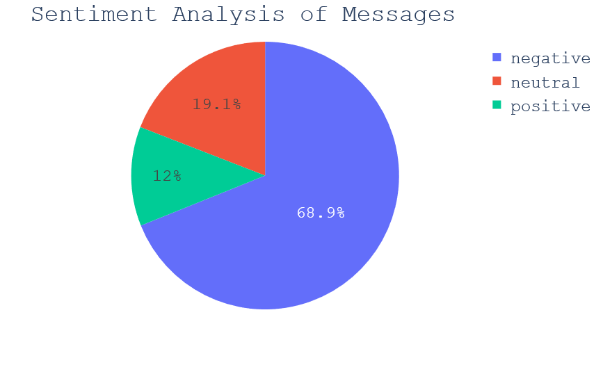
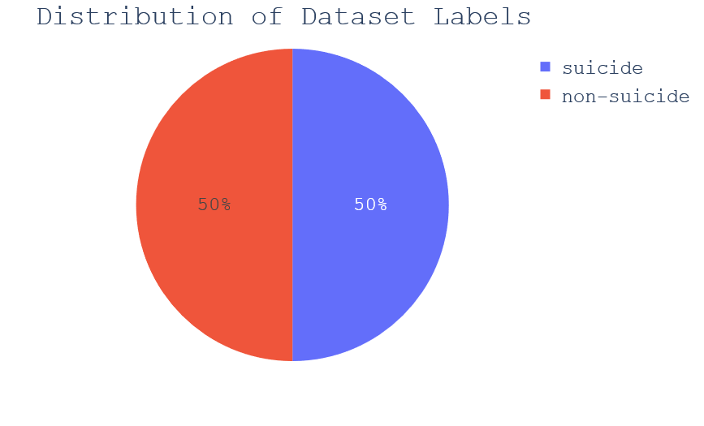
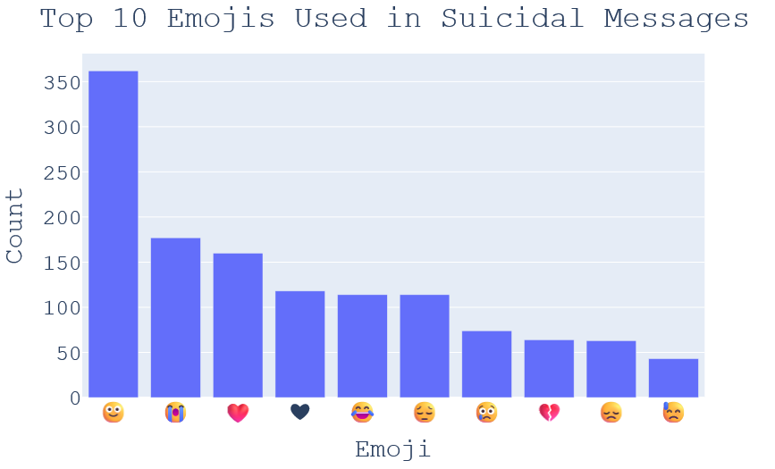
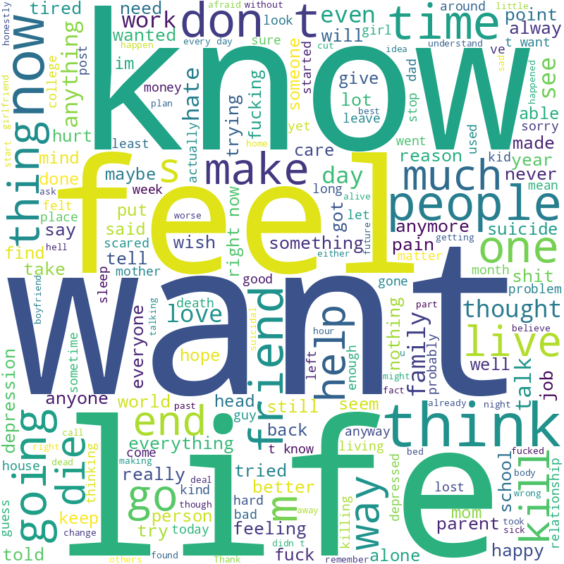
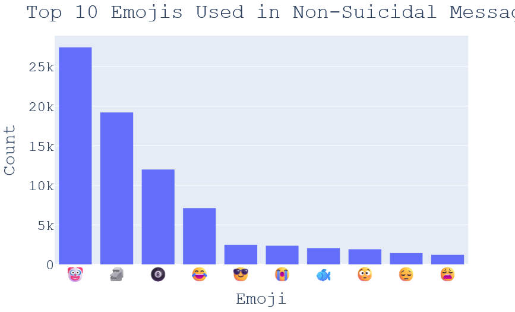
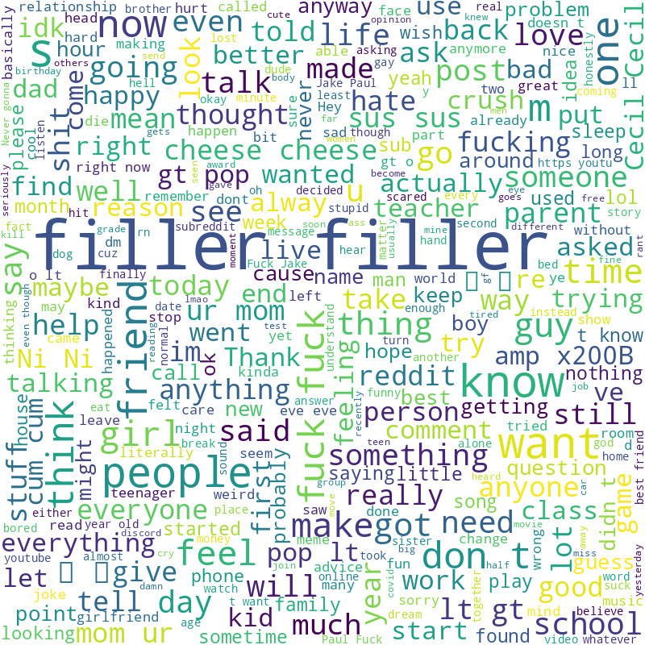

# WellnessSquad: An Augmented Approach to Suicide Ideation Classification


*WellnessSquad* is an updated version of [WellnessOracle](https://github.com/stoyonaga/EECS5327_WellnessOracle), a project developed in GS/EECS 5327, Introduction to Machine Learning & Pattern Recognition by Shogo Toyonaga, Abel Habte, Dongwon Lee, and Jonathan Ramos.

*WellnessSquad* builds on the prior work by:

1. Training the base models on new handcrafted features of the [The Suicide and Depression Detection Dataset](https://www.kaggle.com/datasets/nikhileswarkomati/suicide-watch/data).
    - clean_text
    - average_words_per_sentence
    - Sentiment (roberta-base-sentiment)
    - num_emojis

2. Utilizing Feature Scaling and Pre-Processing 
    - Imputers 
    - StandardScaler 
    - OneHotEncoder 
    - TfidfVectorizer

3. Improved Data Analytics & Visualization
    - Plotly Express 
    - Emojis
    - Streamlit User Interfaces ([Model Inference & Scraping](https://github.com/stoyonaga/WellnessSquad/blob/main/user_interface.py), [Chatbot Interface](https://github.com/stoyonaga/WellnessSquad/blob/main/streamlit-chat.py))
    - [Model Sandbox (Jupyter Notebook)](https://github.com/stoyonaga/WellnessSquad/blob/main/model_playground.ipynb)
    - Optuna Visualizations

4. New Models & New Hyperparameter Tuning Methods
    - [google-bert/bert-base-uncased](https://huggingface.co/google-bert/bert-base-uncased)
    - VotingClassifier
    - Gradient Boosting Classifier
    - Optuna Studies

5. Deep Learning
    - Chatbot feature is supported through the use of prompt engineering, quantization, and [facebook/blenderbot-3B](https://huggingface.co/facebook/blenderbot-3B)
    - Finetuning pretrained classifier ([google-bert/bert-base-uncased](https://huggingface.co/google-bert/bert-base-uncased))

## User Interface
To initialize the application(s), please run the following commands inside the working directory:
```bash
streamlit run .\user_interface.py
streamlit run .\streamlit-chat.py
```
The main application will appear as follows if the environment has been configured properly:

An example dialogue between a user and Cyrus, the large language model, can be seen below:


## Getting Started
> [!WARNING]
> 1. The models used to run the user interface and evaluation are not included in this repository due to file size limitations. You will need to obtain them by running the [training notebooks](https://github.com/stoyonaga/WellnessSquad/tree/main/Notebooks/Models) or reaching out to me.
> 2. The [Chatbot Interface](https://github.com/stoyonaga/WellnessSquad/blob/main/streamlit-chat.py) leverages [facebook/blenderbot-3B](https://huggingface.co/facebook/blenderbot-3B). In order to run the program locally (and of course, optimally) you will need [CUDA](https://developer.nvidia.com/cuda-downloads) and a Graphics Card with **at least** 6 GB of VRAM.

## Data Analytics
I have provided some preliminary data analytics and visualizations from our training dataset. You may also see them in our [Data_Visualizations.ipynb](https://github.com/stoyonaga/WellnessSquad/blob/main/Notebooks/Dataset_Visualizations.ipynb). If you have any questions, please feel free to reach out at any time! :smile: 

## Pipeline 
The new pipeline can be visualized below:


## Hyperparameters
To obtain the optimal hyperparameters, I have added some new code that leverages optuna. Additionally, it offers visualizations to see which features are the most important to improving your models performance.

## Results 
A comparison of the updated models can be seen below. The results are only with relation to the testing set.
As the project progresses, more tables and visualizations will be provided below.

| Model  | Model Accuracy | 
| ------------- | ------------- | 
| [Finetuned BERT-Base-Uncased Classifier](https://github.com/stoyonaga/WellnessSquad/blob/main/Notebooks/Models/FinetunedBERTClassifier.ipynb) | 97.0% | 
| [Logistic Regression](https://github.com/stoyonaga/WellnessSquad/blob/main/Notebooks/Models/LogisticRegression.ipynb) | 94.0% | 
| [VotingClassifier](https://github.com/stoyonaga/WellnessSquad/blob/main/Notebooks/Models/VotingClassifier.ipynb) | 93.0 %|
| [Gradient Boosting Classifier](https://github.com/stoyonaga/WellnessSquad/blob/main/Notebooks/Models/GradientBoosting.ipynb) | 89.3% | 
| [Random Forest](https://github.com/stoyonaga/WellnessSquad/blob/main/Notebooks/Models/RandomForest.ipynb)  | 89.1% |


I would have loved to provide the optimal hyperparameters from running a comprehensive optuna study, however, I do not currently have the available compute.
Nevertheless, I have provided the programming scripts to obtain them if you have a sufficiently strong CPU and an abundance of computing time :P 

## Data Visualizations



### Suicidal Messages


### Non-Suicidal Messages




